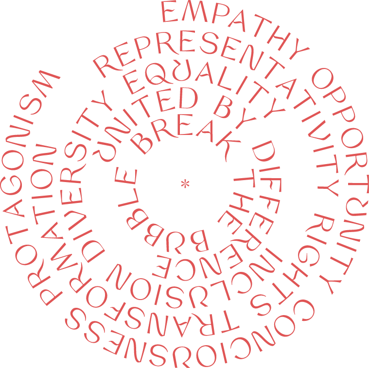

<!DOCTYPE html>
<html>
	<head>
		<meta charset="UTF-8">
		<meta name="viewport"
			content="width=device-width, initial-scale=1, user-scalable=no,maximum-scale=1,minimum-scale=1" />
		<meta http-equiv="Content-Type" content="text/html; charset=UTF-8" />
		<meta http-equiv="X-UA-Compatible" content="IE=edge">
		<title>DIVA* INCLUSIVE</title>
		<link rel="icon" type="image/x-icon" href="images/icon.png">
		<link rel="stylesheet" type="text/css" href="css/style.css">
	</head>

	<body>
		<header class="header pink">
			

				<a href="/" title="Home">*</a>
			

			
			

				<input type="checkbox" id="menuToggle"></input>

				<label for="menuToggle" class="menuOpen">
					Menu
				</label>

				

					<a href="index.html" class="brand" title="Home">*</a>

					<label for="menuToggle" class="inside">Fechar</label>

					

						<ul>
							<li><a href="journal.html">Journal</a></li>
							<li><a href="#">Manifesto</a></li>
							<li><a href="#">Sobre</a></li>
							<li><a href="#">Serviços</a></li>
							<li><a href="#">Contato</a></li>
						</ul>
					

				

			

		</header>

		

			

				

					

						<!-- 
 -->
							<h6 class="subtitle">Nossos serviços</h6>
							<h1 class="title container">Diva*Lab   pesquisa e storytelling com dados.</h1>
							<h6 class="subtitle">Diagnósticos, métricas e tendências em Diversidade.</h6>
						<!-- 
 -->
					

					

						<!-- 
 -->
							<h6 class="subtitle">Nossos serviços</h6>
							<h1 class="title container">Diva*Solutions   prototipar ideias, alimentar a mudança.</h1>
							<h6 class="subtitle">planos de ação para conectar marcas e comunidades   através da criação e gestão de soluções para a inclusão</h6>
						<!-- 
 -->
					

					

						<!-- 
 -->
							<h6 class="subtitle">Nossos serviços</h6>
							<h1 class="title container">Diva*Compass   orientar para incluir, incluir para mudar.</h1>
							<h6 class="subtitle">formações, treinamentos, consultorias em de&i.</h6>
						<!-- 
 -->
					

					

						<!-- 
 -->
							<h6 class="subtitle">Conteúdo</h6>
							<h1 class="title container">Menu Diva*   break your bubble</h1>
							<h6 class="subtitle">Uma fórmula para ampliar seus horizontes:  dicas de filmes, livros, séries, artes, música e  perfis para seguir com foco em diversidade.</h6>
						<!-- 
 -->
					

					

						<!-- 
 -->
							<h6 class="subtitle">Projeto</h6>
							<h1 class="title container">Diva*Todes   linguagem inclusiva não binária</h1>
							<h6 class="subtitle">desenvolvendo ferramentas para combater  o sexismo e o binarismo na linguagem</h6>
						<!-- 
 -->
					

				

				<!-- Add Pagination -->
				

			

		

		

			

				

					<h3 class="subtitle">Equação diva</h3>
					
					

						<h1 class="title">195 países.</h1>
						<h1 class="title">7.53bi de pessoas.</h1>
						<h1 class="title">7,111 idiomas.</h1>
					

					
Tanta gente, tanta diferença, tantas formas singulares de ver o mundo. Todas elas conectadas por traços comuns a todo ser humano. Somos todos contadores de histórias, por exemplo. Essa é uma qualidade que perpassa todas as sociedades. Mas o fato de compartilharmos características comuns não pressupõe igualdade. Nem do ponto de vista narrativo, das histórias. É preciso muita empatia para compreender que a falta de oportunidade causada pela desigualdade é um problema coletivo que só pode ser resolvido através do reconhecimento dos privilégios de uns e das dívidas históricas que a sociedade tem com outres.

					
Tal consciência nos levará a priorizar o protagonismo de indivíduos e comunidades marginalizadas até que alcancemos uma maior harmonia em termos de representatividade. Essa busca é um direito e uma condição para a transformação social. A inclusão e o respeito à diversidade são pilares essenciais para construirmos um mundo mais harmonioso e igualitário. Qual o primeiro passo para iniciar esse caminho? Saia da bolha! 

					<h3 class="subtitle">diva* united by difference</h3>
				

			

			

				<a href="" class="link-manifesto" title="">
					<h1 class="title">Diva*   Manifesto</h1>
					

						
>

					

				</a>
			

		

		

			

				

					

						

							

								
diva*journal

								<h1 class="title">Lorem ipsum dolor sit amet, consectetur adipiscing elit, sed do eiusmod.</h1>

								
Lorem ipsum dolor sit amet, consectetur adipiscing elit, sed do eiusmod tempor incididunt ut labore et dolore magna aliqua. Ut enim ad minim veniam, quis nostrud exercitation ullamco laboris nisi ut aliquip ex ea commodo consequat. 

								<a href="#" title="" class="btn-leia-mais">entenda o assunto ></a>
							

							

						

					

				

				<!-- Add Arrows -->
				

				

				<!-- Add Pagination -->
				

			

		

		

			

				

					
newsletter

					<h1 class="title">Curadoria, conteúdos originais, pesquisa: receba nosso menu semanal.</h1>
					
					

						<input type="text" class="form-control newsletter-input" name="nome" placeholder="NOME">
						<input type="text" class="form-control newsletter-input" name="email" placeholder="EMAIL">
					

					
assinando a newsletter eu concordo em receber conteúdos e ofertas por email da diva inclusive solutions e seus parceiros.

					<button type="button">Enviar ></button>
				

				

					
				

			

		

		<footer class="footer">
			

				

					<h1>DIVA*</h1>
				
	
				

					

						

							<ul>
								<li>
									<a href="#" title="Contato">contato</a>
								</li>
								<li>
									<a href="#" title="Conte sua história">conte sua história</a>
								</li>
								<li>
									<a href="#" title="Seja um investidor">seja um investidor</a>
								</li>
								<li>
									
								</li>
								<li>
									<a href="#" title="Contatos úteis">contatos úteis</a>
								</li>
								<li>
									<a href="#" title="Privacidade">privacidade</a>
								</li>
								<li>
									<a href="#" title="Termos de uso">termos de uso</a>
								</li>
							</ul>
						
	
						

							<ul>
								<li>
									<a href="#" title="se conecte">se conecte</a>
								</li>
								<li>
									<a href="#" title="instagram ">instagram </a>
								</li>
								<li>
									<a href="#" title="youtube">youtube</a>
								</li>
								<li>
									<a href="#" title="facebook">facebook</a>
								</li>
								<li>
									<a href="#" title="linkedin">linkedin</a>
								</li>
								<li>
									<a href="#" title="twitter">twitter</a>
								</li>
							</ul>
						

						

							
copyright diva inclusive solutions 2021© desenvolvido por <a href="mailto:camilla.binni@gmail.com?subject=feedback">Camilla Binni</a> 

						

					

				

			

		</footer>

		
		
		
		<!-- Swiper JS -->
		

		<!-- Initialize Swiper -->
		
	</body>
</html>